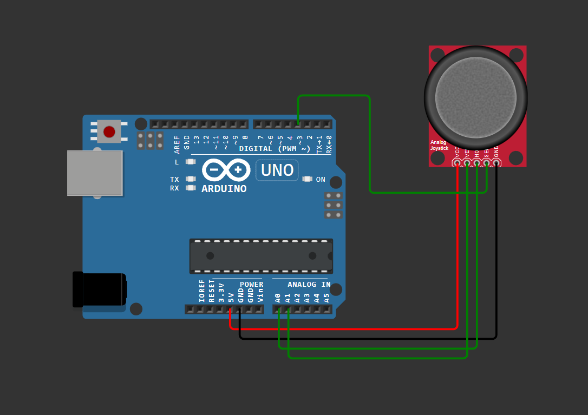

# Arduino-WiFi-Mouse-Controller

A simple IoT project that lets you control your PC's mouse pointer wirelessly using an Arduino UNO R4 WiFi and an analog joystick.
This project was created to learn on how you can establish wireless communication with a microcontoller through WiFi.

## How it Works
1. The Arduino reads the X and Y analog values from the joystick.
2. It maps the values and creates a small payload string (e.g., `15,-5,0`).
3. The data is sent wirelessly via WiFi (UDP packets) to the PC to ensure zero latency and smooth movement.
4. A Python script running on the PC listens to the UDP port, parses the data, and moves the mouse accordingly.

## Hardware Used
* Arduino UNO R4 WiFi (or any Arduino with WiFi capabilities)
* Analog Joystick Module
* Jumper Wires

##  Schematic

